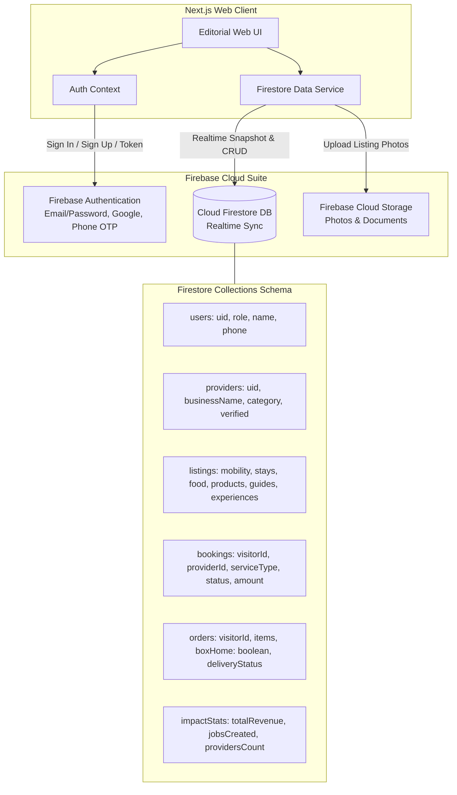

# Kumbh Local — Iterative Website Architecture & Task Phases
> **Platform:** Kumbh Local (Nashik Local Economy Platform)  
> **Track:** KIM Ignite 2026 — Track 3 (Visitor Demand → Local Economic Value)  
> **Backend & Cloud:** Firebase (Auth, Firestore, Storage) + Express/Node API Dual-Mode  
> **Design Language:** Warm Editorial Luxury (`DESIGN-claude.md` + Custom Luxury Earth Palette)  
> **Document Status:** Phases 1–5 Implemented & Verified in Browser (Dev Server Live on http://localhost:3000)  

---

## 1. Design System & Luxury Palette Tokens

Adapted from `DESIGN-claude.md` to incorporate the requested luxury earth palette, retaining the editorial typography, warm linen canvas, and elevated card structures.

### 1.1 Color Tokens

```css
:root {
  /* Brand Luxury Palette */
  --color-terracotta: #B5543A;       /* Primary CTA, brand highlights, active states */
  --color-deep-rust: #5A2E25;        /* Luxury brand anchors, headings, dark badges */
  --color-olive: #6F7F5F;            /* Accent, agricultural/eco badges, verified pills */
  --color-soft-limestone: #F0E6D8;   /* Warm card backgrounds, secondary containers */

  /* Surface & Canvas Hierarchy */
  --color-canvas: #FAF7F2;           /* Primary page floor (warm tinted linen) */
  --color-surface-soft: #F5EFE6;     /* Section alternate backgrounds */
  --color-surface-card: #F0E6D8;     /* Feature cards, product tiles */
  --color-surface-card-hover: #E9DDCB;/* Hover elevation */
  --color-surface-dark: #2A1713;     /* Dark contrasting bands, fulfillment summary */
  --color-surface-dark-elevated: #3A221C;

  /* Typography Colors */
  --color-ink: #231613;              /* Primary text (warm rich black) */
  --color-body: #4E3E3A;             /* Running paragraphs */
  --color-muted: #7E716D;            /* Secondary labels, breadcrumbs */
  --color-muted-light: #B4A9A4;      /* Hairlines, borders */
  --color-hairline: #E3D8CB;         /* 1px divider tone */
  --color-on-primary: #FFFFFF;       /* Text on terracotta */
  --color-on-dark: #FAF7F2;          /* Text on deep rust / dark surfaces */

  /* Feedback / Semantic */
  --color-success: #528059;
  --color-warning: #C9822B;
  --color-error: #B93C3C;
}
```

### 1.2 Typography & Editorial Hierarchy

* **Display & Headings:** `Playfair Display` or `Copernicus / Cormorant Garamond` (Serif, 400/600 weight, -0.02em letter spacing) for an authentic, literary editorial voice.
* **Body & UI Elements:** `Inter` or `Plus Jakarta Sans` (Humanist sans-serif, 400/500 weight) for crisp readability in booking forms, badges, and pricing cards.
* **Badges & Numbers:** Monospace/Sans tabular numerals for prices and booking timestamps (`JetBrains Mono` or tabular `Inter`).

---

## 2. Updated Project Folder Structure (With Firebase Integration)

The monorepo structure incorporates `apps/web` running Next.js with the Firebase Client SDK + fallback mock service:

```text
kumbh-local/
├── package.json                 # Monorepo root workspace scripts (web, api, mobile)
├── package-lock.json
├── apps/
│   ├── api/                     # Node.js + Express + MongoDB Backend (Optional companion)
│   │   ├── package.json
│   │   ├── tsconfig.json
│   │   └── src/
│   ├── web/                     # Next.js (App Router) + Tailwind + Firebase
│   │   ├── package.json
│   │   ├── tsconfig.json
│   │   ├── next.config.js
│   │   ├── tailwind.config.ts   # Configured with Luxury Palette tokens
│   │   ├── .env.example         # Firebase configuration keys
│   │   ├── public/              # Static assets, hero images, icons
│   │   └── src/
│   │       ├── app/             # App Router Pages (Clean Flat Routing)
│   │       │   ├── layout.tsx   # Root layout with Editorial Nav, Footer & Firebase Auth Provider
│   │       │   ├── page.tsx     # Homepage (Hero, Sectors, Demo Journey, Impact)
│   │       │   ├── login/page.tsx          # Login & 1-click Pitch Switcher
│   │       │   ├── register/page.tsx       # Visitor / Provider Onboarding
│   │       │   ├── mobility/page.tsx       # Shuttles, E-Rickshaws & Stations
│   │       │   ├── stays/page.tsx          # Homestays, Dharamshalas
│   │       │   ├── food/page.tsx           # Breakfast Trails, Misal, Home Kitchens
│   │       │   ├── guides/page.tsx         # Multilingual Heritage & Student Guides
│   │       │   ├── experiences/page.tsx    # Village, Agrotourism & Farm Tours
│   │       │   ├── products/page.tsx       # GI Raisins, Artisanal Brassware, Spices
│   │       │   ├── box-home/page.tsx       # "Send My Nashik Box Home" Feature
│   │       │   ├── checkout/page.tsx       # Unified Cart & Checkout
│   │       │   ├── bookings/page.tsx       # My Passes & Offline Digital QR Passes
│   │       │   ├── impact-summary/page.tsx # Economic Beneficiary Impact Receipt
│   │       │   ├── provider/dashboard/page.tsx # Provider Hub & Operations
│   │       │   └── admin/dashboard/page.tsx    # Macro Economic Impact Dashboard
│   │       ├── components/
│   │       │   ├── ui/          # Buttons, Cards, Modals, Badges, Tabs
│   │       │   ├── layout/      # Navbar, Editorial Footer, Sidebars
│   │       │   ├── visitor/     # Sector Cards, Booking Modals, Flow Steps
│   │       │   └── shared/      # Economic Impact Badge, Currency Display
│   │       ├── context/
│   │       │   ├── AuthContext.tsx    # Firebase Auth Listener + Role State
│   │       │   ├── CartContext.tsx    # Cart & Nashik Box Items
│   │       │   └── ImpactContext.tsx  # Dynamic Economic Impact Calculator
│   │       ├── lib/
│   │       │   ├── firebase.ts        # Firebase Client Initialization (Auth, Firestore, Storage)
│   │       │   ├── firestore.ts       # Firestore Collections & CRUD operations
│   │       │   ├── seedData.ts        # High-fidelity mock seed data (offline fallback)
│   │       │   └── utils.ts
│   │       └── types/           # Shared TypeScript interfaces (User, Provider, Listing, Booking)
│   └── mobile/                  # Existing Mobile App (Kotlin/Android)
└── docs/
    ├── KUMBH_LOCAL.md
    ├── DESIGN-claude.md
    └── TASK_PHASES.md
```

---

## 3. Firebase Cloud Architecture



> **Dual-Mode Reliability Feature:** The `firestore.ts` client is designed to automatically detect if Firebase credentials are present. If active credentials exist, it operates against live Firebase. If running in an offline presentation environment, it transparently serves rich seeded collections so the entire application functions without network dependencies during demo pitches.

---

## 4. Phase-by-Phase Task Breakdown (Incorporating Firebase)

### Phase 1: Foundation, Design System & Firebase Setup
* **Objective:** Initialize `apps/web` with Next.js, configure Tailwind luxury palette tokens, initialize the Firebase SDK, and build core reusable components.
* **Key Tasks:**
  1. Initialize `apps/web` with Next.js (App Router), TypeScript, and Tailwind CSS.
  2. Implement CSS variables and Tailwind theme extensions for:
     - `terracotta` (`#B5543A`), `deep-rust` (`#5A2E25`), `olive` (`#6F7F5F`), `soft-limestone` (`#F0E6D8`), `canvas` (`#FAF7F2`), `ink` (`#231613`).
  3. Configure Google Fonts (`Playfair Display` serif + `Plus Jakarta Sans` / `Inter`).
  4. Create `src/lib/firebase.ts` with Firebase App, Auth, Firestore, and Storage configurations.
  5. Build core UI library:
     - `Button` (Primary Terracotta, Secondary Limestone, Outline Deep Rust)
     - `Card` (Limestone surface, gentle hairlines, editorial spacing)
     - `Badge` (Pill badges for "Verified Provider", "Village Direct", "Eco Shuttle")
     - `Modal` / `Drawer` for fast booking without page context loss.
  6. Add root `package.json` scripts (`npm run dev:web`, `npm run dev:all`).

### Phase 2: Firebase Authentication & Role Management
* **Objective:** Implement Firebase Auth supporting Visitors, Providers, and Admins, with immediate demo switching.
* **Key Tasks:**
  1. **Firebase Auth Integration:** Email/Password and Google Sign-in flow.
  2. **Role Storage in Firestore:** Save user profile and role (`VISITOR`, `PROVIDER`, `ADMIN`) in Firestore `/users/{uid}`.
  3. **Role Switcher Demo Helper:** Quick one-click switch between *Visitor* (Rahul), *Provider* (Godavari Homestay / Cab Owner), and *Admin* for frictionless competition demonstrations.
  4. **Editorial Top Navigation:** Warm top-nav with active category pills, Cart count, Role badge, and "Send My Nashik Box Home" direct CTA.

### Phase 3: The 6 Sector Discovery & Booking Flows (Visitor Journey)
* **Objective:** Enable interactive discovery, filtering, and booking for all six core economic verticals backed by Firestore collections.
* **Key Tasks:**
  1. **Mobility (`/mobility`):**
     - Arrival stations: *Nashik Road Railway Station*, *CBS Bus Stand*, *Panchavati*, *Trimbakeshwar*.
     - Vehicle types: *Shared E-Rickshaw*, *Kumbh Shuttle*, *Private Taxi*.
     - Instant seat reservation with route map card and pickup time indicator.
  2. **Stay Network (`/stays`):**
     - Homestays, Dharamshalas, Guest Houses with distance from Godavari Ghats/Panchavati.
     - Amenities chips (Home breakfast, WiFi, hot water, parking).
  3. **Local Food Network (`/food`):**
     - Authentic Nashik trails (Poha & Misal Pav Breakfast Trail, Khandeshi Thali, Home Kitchens).
     - Dietary tags, preparation times, provider story.
  4. **Local Guide Network (`/guides`):**
     - Multilingual local guides (Marathi, Hindi, English).
     - Specialties: *Panchavati Heritage Walk*, *Godavari Aarti & Rituals*, *Student Photographers*.
  5. **Village & Farm Experiences (`/experiences`):**
     - Agrotourism visits (Grape harvest & raisin drying in Dindori/Trimbak, Warli painting workshop).
  6. **Local Products Marketplace (`/products`):**
     - GI-tagged Nashik raisins, artisanal brassware, local spices, Paithani crafts.
     - Add to cart with single-click fulfillment toggle.

### Phase 4: "Send My Nashik Box Home" & Consolidated Checkout
* **Objective:** Deliver the unique economic feature where visitors ship bulk local goods home without carrying luggage.
* **Key Tasks:**
  1. **Nashik Box Feature Drawer / Page:**
     - Curate a custom gift box combining products from multiple Nashik farmers and artisans.
     - Packaging options (Eco-friendly jute bag, corrugated gift hamper).
  2. **Unified Cart & Checkout:**
     - Combines bookings (Mobility, Stay, Guides) and physical goods (Products, Box Home).
     - Shipping address entry for interstate visitors.
     - Records orders and bookings into Firestore `/bookings` and `/orders`.
     - Mock instant payment gateway with UPI / Card toggle and receipt generation.
  3. **Fulfillment Partner Handoff:**
     - Displays the assigned Nashik logistics partner (e.g. *Godavari Swift Logistics - Rider assigned*).

### Phase 5: Economic Impact Receipt & Impact Dashboard
* **Objective:** The centerpiece of the KIM Ignite competition presentation — visually proving economic value distributed to Nashik residents.
* **Key Tasks:**
  1. **Personal Impact Receipt (`/impact-summary`):**
     - Rendered after checkout or viewable anytime from the profile.
     - Visual breakdown:
       - 1 Local Driver supported (₹80)
       - 1 Homestay Family supported (₹900)
       - 1 Student Guide empowered (₹299)
       - 1 Local Kitchen supported (₹199)
       - 1 Grape Farmer supported (₹300)
       - 1 Local Packing & Delivery Job supported (₹120)
     - Downloadable/Shareable "Proud Nashik Patron" card.
  2. **Admin Macro Economic Dashboard (`/admin/dashboard`):**
     - High-level metrics: Total Local Transactions (₹ Lakhs), Service Jobs Created, Registered Providers by Category.
     - Live Provider Verification Table (Approve/Reject pending local sellers stored in Firestore).
     - Sector distribution charts and recent booking streams.

### Phase 6: Provider Portal & End-to-End Polish
* **Objective:** Complete the provider experience with real-time Firestore listeners and end-to-end polish.
* **Key Tasks:**
  1. **Provider Hub (`/provider/dashboard`):**
     - Real-time Firestore snapshot listener for received bookings, order fulfillment status, and monthly earnings payout summary.
     - "Add New Listing" form with photo upload via Firebase Storage.
  2. **Dual-Mode Persistence:**
     - Seamless fallback to rich seed data so the website functions flawlessly both standalone and when connected to live Firebase.
  3. **Visual Polish:**
     - Subtle micro-interactions, smooth tabs, responsive mobile and tablet layouts.
     - Strict verification against the Terracotta, Deep Rust, Limestone, and Olive palette.

---

## 5. Live Demo Script for KIM Ignite 2026

1. **Opening (0:00 - 0:30):** Hero page emphasizing the core thesis: *“Kumbh brings millions of visitors, but spending often bypasses local homes. Kumbh Local turns every visitor into a direct economic benefactor.”*
2. **Visitor Journey (0:30 - 2:00):** 
   - Arrive at *Nashik Road Station* → book a ₹80 shared e-rickshaw.
   - Reserve a room at *Godavari Homestay* (₹900/night).
   - Order the *Nashik Misal Trail* for breakfast.
   - Book a student guide for the *Panchavati Heritage Walk*.
   - Add fresh Nashik raisins and Warli art to cart, select **"Send My Nashik Box Home"**.
3. **The Climax — Impact Receipt (2:00 - 2:40):** 
   - Checkout generates the **Economic Impact Receipt**, showing 6 distinct local Nashik families and gig workers earning immediate income from this single visitor.
4. **The Macro Ecosystem (2:40 - 3:30):** 
   - Switch to **Admin Dashboard** to show city-wide metrics: ₹28.4 Lakhs in local transactions, 1,860 gig opportunities generated, 1,248 verified local providers.
